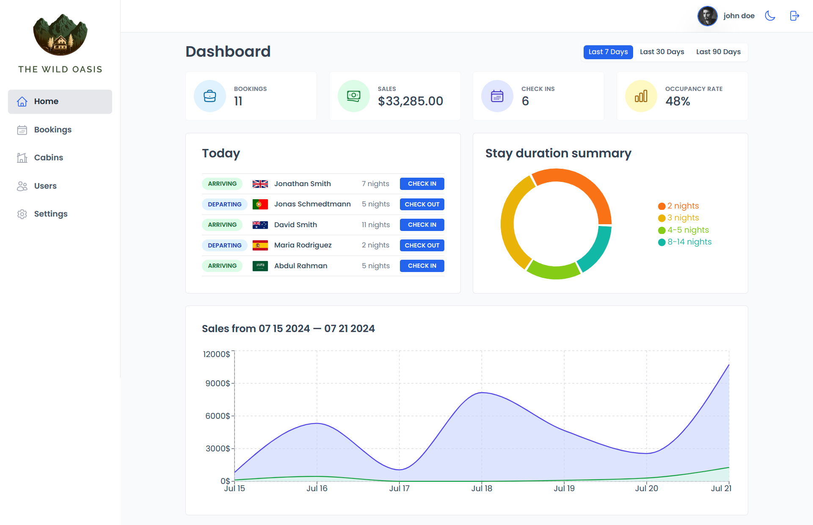

# The Wild Oasis App



## Introduction

The Wild Oasis App is a comprehensive hotel booking management system designed to streamline the process of managing hotel reservations, guests, and related activities. Inspired by the Wild Oasis app from Jonas Schmedtmann's React course on Udemy, this application leverages modern web development technologies to deliver a seamless and intuitive user experience.

The app provides a user-friendly interface for hotel staff to manage bookings, check-ins, check-outs, cabins, create more user staff and view detailed statistics about hotel operations. With responsive design and an efficient state management system.

### Features

- **User Authentication**: Secure login and logout functionalities for authorized access.
- **Dashboard**: A comprehensive overview of hotel statistics, including occupancy rates, total bookings, and sales data.
- **Booking Management**: Tools to view and delete bookings, along with check-in and check-out functionalities.
- **Detailed Booking Views**: In-depth information about individual bookings, including guest details, stay duration, and payment status.
- **Dynamic Charts**: Visualization of sales and booking trends with interactive charts.
- **Dark Mode**: Seamless switching between light and dark modes for better user experience.

The application is built using React for the frontend, with Tailwind CSS for styling. It is designed to be easily extendable and customizable, making it suitable for various hotel management needs.

## Usage

To get started with the Wild Oasis Booking App, follow these steps:

1. **Clone the repository**:

```bash
git clone https://github.com/ibrahim11elian/hotel-dashboard.git
cd hotel-dashboard
```

2. **Install dependencies**:

```bash
npm install
```

3. **Start the development server**:

```bash
npm run dev
```

This will run the app in development mode. Open [http://localhost:3000](http://localhost:3000) to view it in the browser.

4. **Build the app for production**:

```bash
npm run build
```

This will create an optimized production build of the app in the `dist` folder.

5. **Run the app in production mode**:

```bash
npm run preview
```

This will serve the production build of the app.

### Environment Variables

The app requires certain environment variables to be set. Create a `.env` file in the root directory of your project and add the following variables:

```.env
VITE_SUPABASE_ROLE_KEY=your supabase role key
VITE_SUPABASE_URL=your supabase url
```

Replace `<your supabase role key>`, `<your supabase url>` with your actual values.

## Tech Stack

The Wild Oasis Booking App is built using the following technologies:

- **React**: A JavaScript library for building user interfaces.

- **React Router**: A standard library for routing in React.

- **React Query**: A library for fetching, caching, and updating asynchronous data in React applications.

- **Tailwind CSS**: A utility-first CSS framework for rapidly building custom user interfaces.

- **Supabase**: An open-source Firebase alternative. Supabase is used for authentication, database management, and file storage in the app.

- **Recharts**: A charting library built on React components. Recharts is used to create interactive and customizable data visualizations in the app.

- **date-fns**: A modern JavaScript date utility library. date-fns is used for parsing, formatting, and manipulating dates in the app.

- **react-hook-form**: A library for managing form state and validation in React.

- **react-hot-toast**: A library for displaying customizable toast notifications in React applications.

- **Vite**: A fast build tool and development server.

## Live version

You can access the live version of this app by navigating to [This url](https://the-wild-oasis-hotel-sigma.vercel.app/)  
also you can login to the app by using this email `admin@admin.com` and this password `12345678`.

## Acknowledgments

This project is based on the Wild Oasis Booking App built during Jonas Schmedtmann's React course on Udemy. Special thanks to Jonas for his comprehensive and insightful tutorials, which have greatly contributed to the development of this application.

You can check out Jonas Schmedtmann's course on Udemy for more amazing content and projects.

## Author

<p align="left">

<a href="https://www.linkedin.com/in/ibrahim-ahmed-a8bba9196" target="_blank">
</a>
<a href="https://www.facebook.com/ibrahim11ahmed" target="_blank">
</a>
<a href="mailto:ibrahim11elian@gmail.com" target="_blank">
</a>
<a href="tel:+201157676284" target="_blank">
</a>
<a href="https://www.instagram.com/ibrahim11ahmed/" target="_blank">
</a>
<a href="https://twitter.com/ibrahim11elian" target="_blank">
<a href="https://leetcode.com/ibrahim11elian" target="_blank">

</p>
